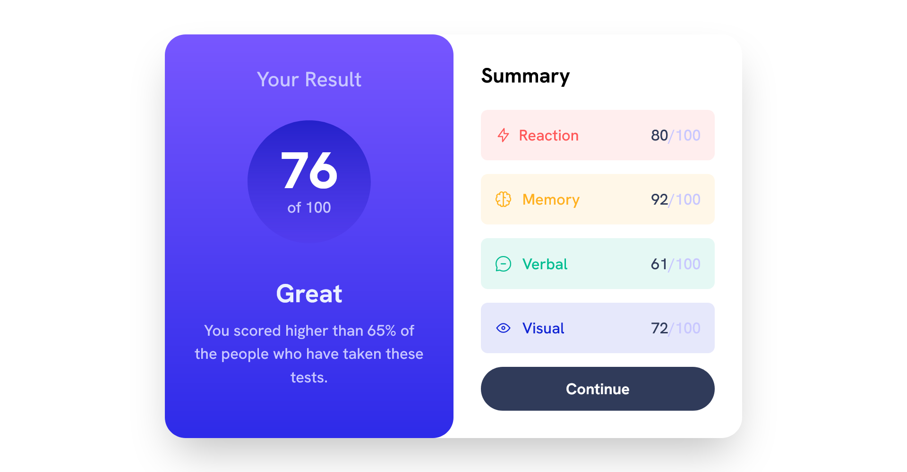

# Frontend Mentor - Results summary component solution

This is a solution to the [Results summary component challenge on Frontend Mentor](https://www.frontendmentor.io/challenges/results-summary-component-CE_K6s0maV). Frontend Mentor challenges help you improve your coding skills by building realistic projects. 

## Table of contents

- [Overview](#overview)
  - [The challenge](#the-challenge)
  - [Screenshot](#screenshot)
  - [Links](#links)
- [My process](#my-process)
  - [Built with](#built-with)
  - [What I learned](#what-i-learned)
- [Author](#author)

## Overview

### The challenge

Users should be able to:

- View the optimal layout for the interface depending on their device's screen size
- See hover and focus states for all interactive elements on the page

### Screenshot

- Mobile version

- Desktop version

### Links

- Solution URL: [https://github.com/MIBENIN/Result-summary-component](https://github.com/MIBENIN/Result-summary-component)

- Live Site URL: [https://mibenin.github.io/Result-summary-component/](https://mibenin.github.io/Result-summary-component/)

## My process

### Built with

- Flexbox
- Mobile-first workflow
- [tailwindcss](https://tailwindcss.com/) - CSS Framework

### What I learned

  I learned to host tailwind projects to github and build live site using github pages
  
## Author

- Coded by Benin S

