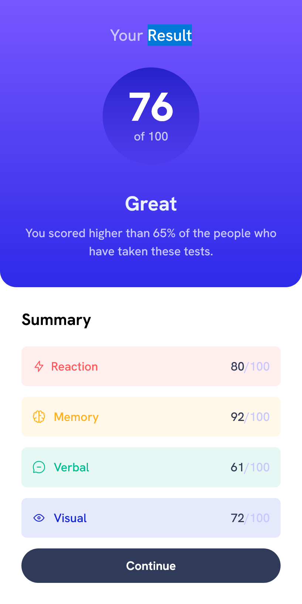

# Frontend Mentor - Results summary component solution

This is a solution to the [Results summary component challenge on Frontend Mentor](https://www.frontendmentor.io/challenges/results-summary-component-CE_K6s0maV). Frontend Mentor challenges help you improve your coding skills by building realistic projects. 

## Table of contents

- [Overview](#overview)
  - [The challenge](#the-challenge)
  - [Screenshot](#screenshot)
  - [Links](#links)
- [My process](#my-process)
  - [Built with](#built-with)
  - [What I learned](#what-i-learned)
- [Author](#author)

## Overview

### The challenge

Users should be able to:

- View the optimal layout for the interface depending on their device's screen size
- See hover and focus states for all interactive elements on the page

### Screenshot

- Mobile version 

- Desktop version

### Links

- Solution URL: [https://github.com/MIBENIN/Result-summary-component](https://github.com/MIBENIN/Result-summary-component)

- Live Site URL: [https://mibenin.github.io/Result-summary-component/](https://mibenin.github.io/Result-summary-component/)

## My process

### Built with

- Flexbox
- Mobile-first workflow
- [tailwindcss](https://tailwindcss.com/) - CSS Framework

### What I learned

  I learned to host tailwind projects to github and build live site using github pages

Use this section to outline areas that you want to continue focusing on in future projects. These could be concepts you're still not completely comfortable with or techniques you found useful that you want to refine and perfect.

**Note: Delete this note and the content within this section and replace with your own plans for continued development.**

## Author

- Coded by Benin S

